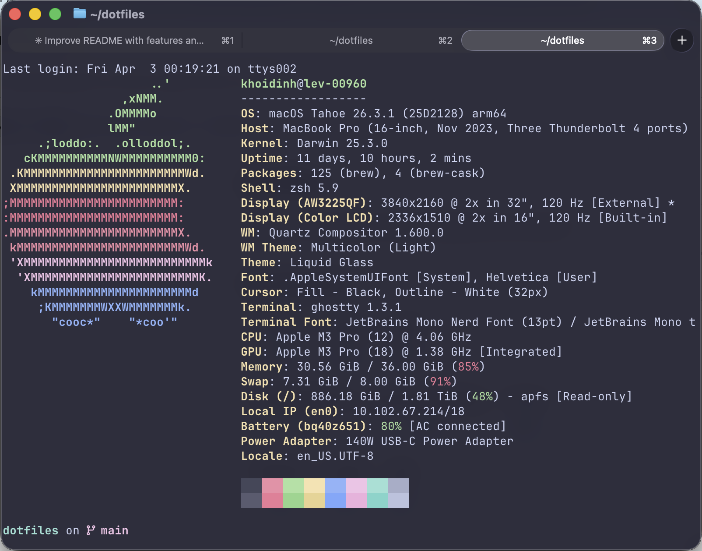
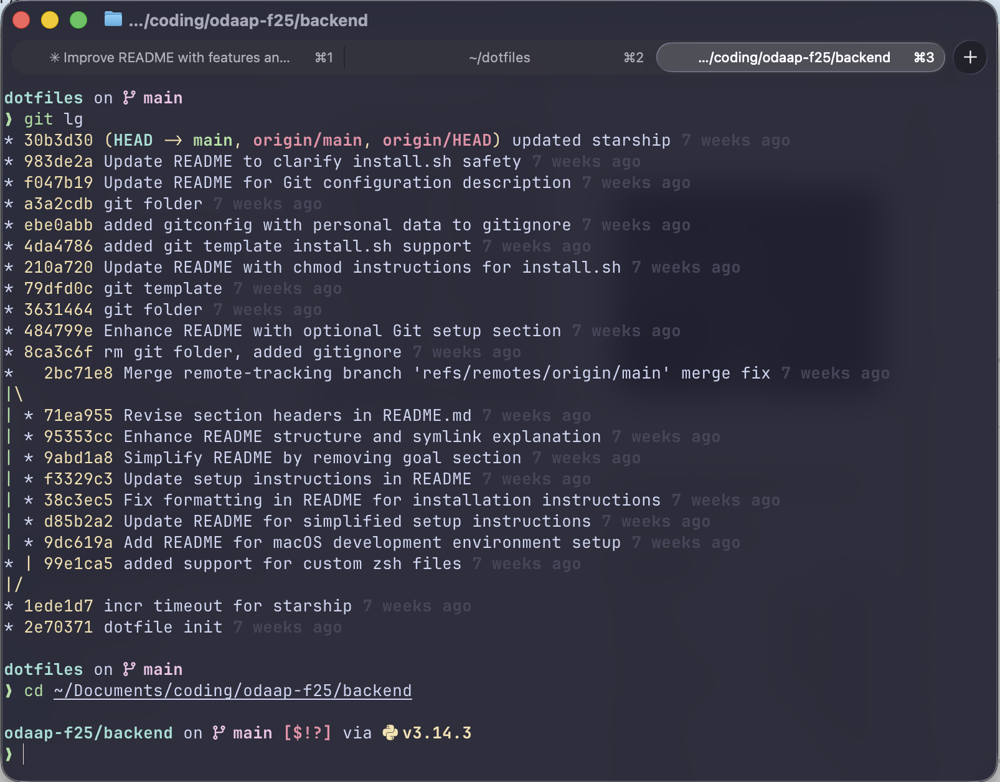
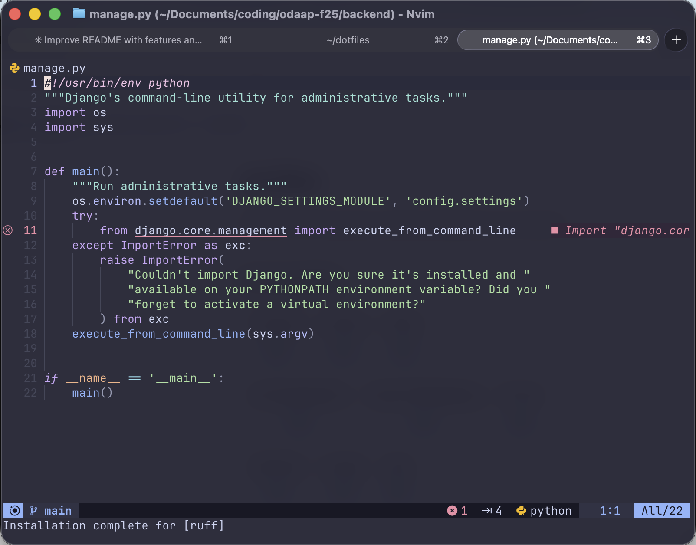
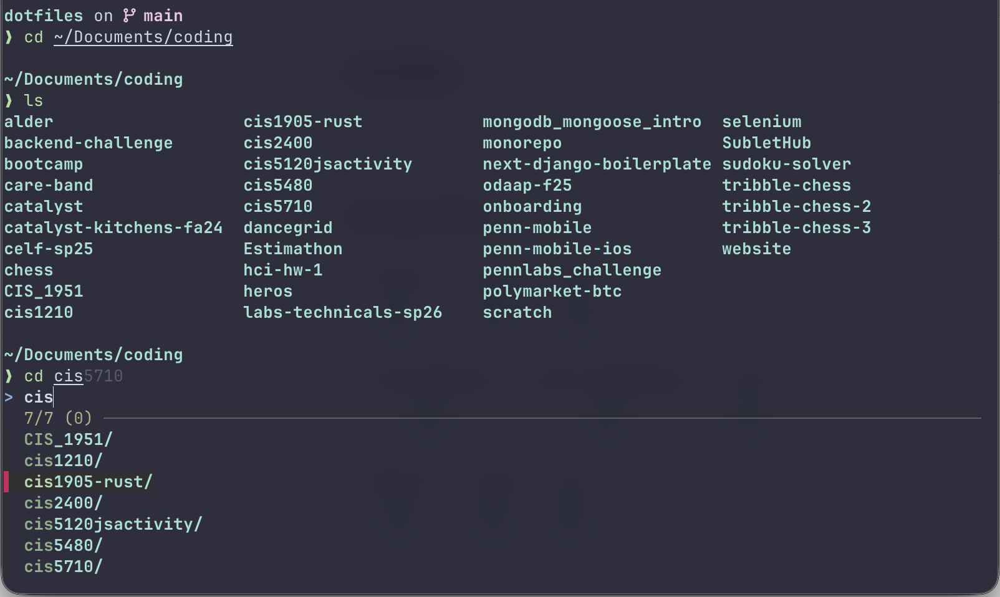
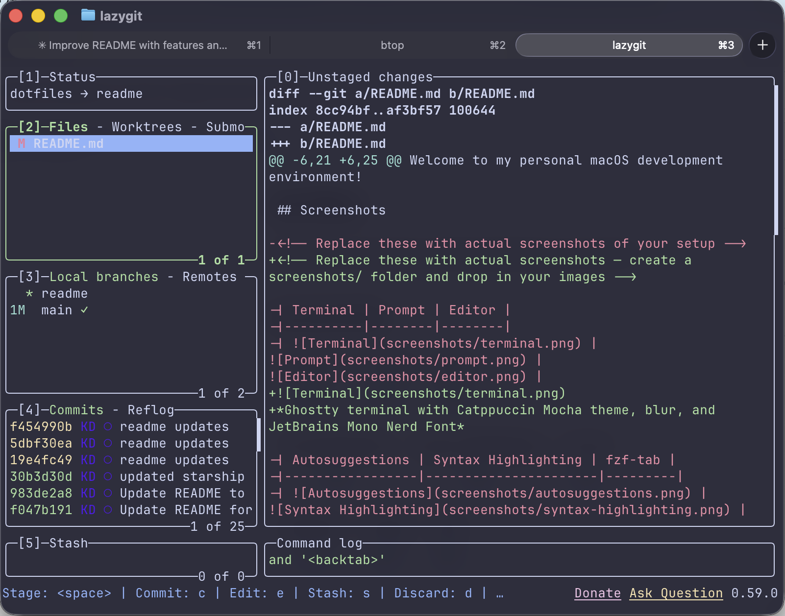
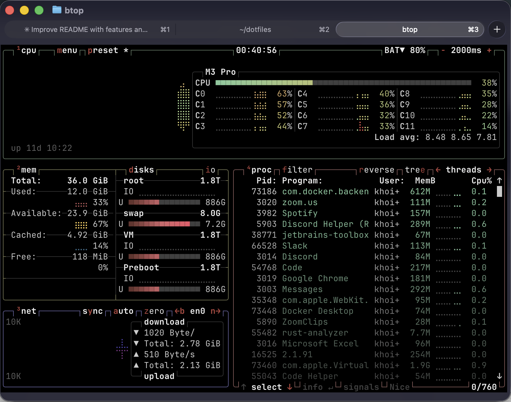

# dotfiles

A complete macOS dev environment with auto-installer.

---

## Screenshots

<!-- Replace these with actual screenshots — create a screenshots/ folder and drop in your images -->

<p align="center">
  
  <br/>
  <em>Ghostty terminal with Catppuccin Mocha theme, blur, and JetBrains Mono Nerd Font</em>
</p>

<table>
  <tr>
    <td align="center" width="50%">
      
      <br/>
      <em>Fancy prompt with git branch and language context</em>
    </td>
    <td align="center" width="50%">
      
      <br/>
      <em>LunarVim with syntax highlighting and file explorer</em>
    </td>
  </tr>
  <tr>
    <td align="center" width="50%">
      
      <br/>
      <em>Dropdown autosuggestions during tab completion</em>
    </td>
    <td align="center" width="50%">
      
      <br/>
      <em>lazygit terminal UI for commits, branches, and diffs</em>
    </td>
  </tr>
  <tr>
    <td align="center" colspan="2">
      
      <br/>
      <em>btop resource monitor showing CPU, memory, network, and processes</em>
    </td>
  </tr>
</table>

---

## What's Included

### Terminal — Ghostty
- Catppuccin Mocha theme
- JetBrains Mono Nerd Font
- Window blur + opacity
- Quick Terminal keybind (`Cmd + \`)

### Shell — Zsh
- Oh My Zsh with autosuggestions, syntax highlighting, and fzf-tab
- Starship prompt
- fastfetch on startup

### Editor — LunarVim
- Neovim + LunarVim (release 1.4)
- ripgrep, node, python, rust toolchains

### Python
- pyenv for version management — install and switch between multiple Python versions without touching the system Python

<details>
<summary><strong>pyenv Usage Guide</strong></summary>

#### List available Python versions

```
pyenv install --list
```

#### Install a specific version

```
pyenv install 3.12.2
```

#### Set a global default version

```
pyenv global 3.12.2
```

This sets the Python version used across your entire system (outside of any project-specific overrides).

#### Set a project-local version

```
cd ~/my-project
pyenv local 3.11.8
```

This creates a `.python-version` file in the project directory. Whenever you `cd` into that directory, pyenv automatically switches to that version.

#### Check which version is active

```
pyenv version
```

#### List all installed versions

```
pyenv versions
```

#### Uninstall a version

```
pyenv uninstall 3.10.4
```

</details>

### CLI Tools
- fzf, lazygit, btop, fastfetch

### Git (optional)
Sets up rebase-by-default pulls, clearer merge conflicts, and common aliases (status, branch, checkout, log graphs, amend, undo) so you don't have to configure them yourself every time.
- Rebase-based pull, auto-stash, zdiff3 conflict style
- Curated aliases for status, logs, and commit helpers
- macOS keychain credential storage

### GPG Commit Signing (optional)
Signs your commits and tags so GitHub shows them as **Verified**, with a macOS passphrase prompt instead of a broken terminal prompt.
- Installs `gnupg` + `pinentry-mac` and wires up `gpg-agent`
- Sets `GPG_TTY` in the shell, which fixes the common `gpg: signing failed: Inappropriate ioctl for device` error

---

## Setup

First, clone the repo:

```
git clone https://github.com/YOUR_USERNAME/dotfiles.git ~/dotfiles
cd ~/dotfiles
./install.sh
```

To add execute permissions to the installer, you may need to run:

```
chmod +x install.sh
```

Restart your terminal after installation. 
**Note that you should use terminal from the Ghostty App for all the features to take effect.**

**Re-running install.sh is safe (if you want to change any flags or configs).**

---

## Optional: Git Setup

Git configuration is opt-in. Sets up rebase-by-default pulls, clearer merge conflicts, and common aliases (status, branch, checkout, log graphs, amend, undo) so you don't have to configure them yourself every time.

If you want this repo to manage your global git config (including aliases and pull defaults), run:

```
./install.sh --git --git-name "Your Name" --git-email "you@example.com"
```

This will:

- Generate `git/gitconfig` from a template
- Overwrite it on re-run (safe to fix mistakes)
- Symlink it to `~/.gitconfig`

Re-running with different name/email will update your identity.

If `--git` is not passed, your existing `~/.gitconfig` is untouched.

---

## Optional: GPG Commit Signing

Commit signing is opt-in and layers on top of `--git`. Every commit and tag you make gets signed with your GPG key, and GitHub marks them **Verified**.

You pass the key explicitly — the installer never picks a key for you and never creates one. That keeps re-runs predictable on machines with more than one key.

<details>
<summary><strong>GPG Setup Guide</strong></summary>

### 1. Get a key

If you already have one, list it:

```
gpg --list-secret-keys --keyid-format=long
```

```
sec   ed25519/ABCD1234EF567890 2026-09-02 [SC]
      B17A5BFCBEC380C201A6A252648A68FDFCEB6DC8
uid                 [ultimate] Your Name <you@example.com>
```

The key ID is the part after the slash on the `sec` line — `ABCD1234EF567890` above.

If you don't have a key, create one (choose the defaults; you'll be asked for a name, email, and passphrase):

```
gpg --full-generate-key
```

> **The key's email must match the email you pass to `--git-email`.** GitHub only shows a commit as Verified when the commit author email matches an email on the signing key *and* on your GitHub account.

### 2. Run the installer

```
./install.sh --git --git-name "Your Name" --git-email "you@example.com" --gpg-key ABCD1234EF567890
```

This will:

- Install `gnupg` and `pinentry-mac` (a native macOS passphrase prompt instead of a terminal one)
- Point `gpg-agent` at `pinentry-mac` via `~/.gnupg/gpg-agent.conf`, then restart the agent
- Add `user.signingkey`, `commit.gpgsign`, `tag.gpgsign`, and `gpg.program` to the generated git config

If the key isn't in your keyring, the installer stops before touching your git config. Passing `--gpg-key` without `--git` is also an error, since the signing settings are written into the generated config.

### 3. Add the public key to GitHub

Export it:

```
gpg --armor --export ABCD1234EF567890
```

Copy the whole block, including the `-----BEGIN PGP PUBLIC KEY BLOCK-----` and `-----END-----` lines, and paste it into GitHub under **Settings → SSH and GPG keys → New GPG key**.

### 4. Verify it works

Open a new terminal first, so the updated `zshrc` is loaded, then:

```
git config --get commit.gpgsign
git commit --allow-empty -m "test signing"
git log --show-signature -1
```

You should be prompted for your passphrase in a macOS dialog, and the log should show `Good signature from "Your Name <you@example.com>"`. Clean up the test commit with:

```
git reset --hard HEAD~1
```

### Fixing `gpg: signing failed: Inappropriate ioctl for device`

This happens when GPG has no terminal to draw its passphrase prompt on. The fix for the current session:

```
export GPG_TTY=$(tty)
```

`zsh/zshrc` already exports `GPG_TTY` on every shell start (when `gpg` is installed), so once these dotfiles are linked the fix is permanent — you don't need to add it yourself. You do need a **new** shell for it to take effect, since the export runs at shell startup.

If it still fails, restart the agent:

```
gpgconf --kill gpg-agent
```

### Turning signing off

Re-run `install.sh` with `--git` but without `--gpg-key` — the config is regenerated from the template each time, so the signing block disappears.

For a one-off unsigned commit:

```
git commit --no-gpg-sign
```

### Notes

- `git/gitconfig` is generated and gitignored; only `git/gitconfig.template` is committed, so your key ID never ends up in the repo.
- Re-running the installer is safe. `~/.gnupg/gpg-agent.conf` is updated in place rather than accumulating duplicate `pinentry-program` lines.
- Signing is global once linked, so it applies to every repo on the machine.

</details>

---

<details>
<summary><strong>Git Configuration Details</strong></summary>

### Defaults

- `pull.rebase = true`  
  Makes `git pull` use rebase instead of merge.  
  Keeps history linear and avoids unnecessary merge commits.

- `rebase.autoStash = true`  
  Automatically stashes uncommitted changes before rebasing and reapplies them afterward.  
  Prevents pull failures due to a dirty working directory.

- `push.default = current`  
  Pushes the current branch to its upstream counterpart only.  
  Safer than older default behaviors.

- `merge.conflictstyle = zdiff3`  
  Shows base/ours/theirs during merge conflicts.  
  Makes resolving conflicts much clearer.

- `credential.helper = osxkeychain`  
  Uses macOS keychain for storing Git credentials securely.

---

### Aliases

#### Navigation / Status

- `git st`  
  Short for `git status -sb`  
  Shows concise branch + status information.

- `git br`  
  Short for `git branch`

- `git co`  
  Short for `git checkout`

- `git sw`  
  Short for `git switch`

---

#### Logs

- `git lg`  
  Compact visual commit graph with timestamps.  
  Good daily driver log view.

- `git lga`  
  Full repository graph across all branches.  
  Useful for understanding overall history.

- `git lgb`  
  Detailed branch-focused graph showing:
  - Commit hash
  - Branch decorations
  - Relative time
  - Author name

  Good for reviewing feature branch history before merging.

---

#### Commit Helpers

- `git amend`  
  Amends the previous commit without editing the message.  
  Useful for quick fixes.

- `git undo`  
  Equivalent to `git reset --soft HEAD~1`  
  Removes the last commit but keeps changes staged.

---

#### File Inspection

- `git changed`  
  Shows modified (unstaged) file names only.

- `git changedstaged`  
  Shows staged file names only.

</details>

---

## Updating

To pull the latest changes and re-apply them:

```
cd ~/dotfiles
git pull
./install.sh
```

If you're using the git config, re-run with your flags:

```
./install.sh --git --git-name "Your Name" --git-email "you@example.com"
```

Add `--gpg-key YOUR_KEY_ID` to that command if you're using commit signing.

---

## Structure

```
dotfiles/
  install.sh
  Brewfile
  zsh/
  ghostty/
  starship/
  lvim/
  git/
```

All configs are automatically symlinked from this repository.

---

## Notes

Local machine-only overrides go in ~/.zsh_custom  
SSH keys are not managed here  
Fonts are installed via Homebrew  

---

## Extras

### Ghostty Quick Terminal
The keybind (cmd + \\) is already included in the ghostty config files on installation.  
However, to make this work on MacOS you need to allow additional permissions. As of writing (Feb 12, 2026), these are found in:

System Settings > Privacy and Security > Accessibility

### VS Code
This is not included in the dotfiles. However, I use Vira theme (Vira Teal High Contrast).  
To take advantage of nerd fonts, do:

```
brew install --cask font-hack-nerd-font
```

Then go to the terminal settings under fonts and replace with:

Hack Nerd Font, Menlo, Monaco, Courier New, monospace
